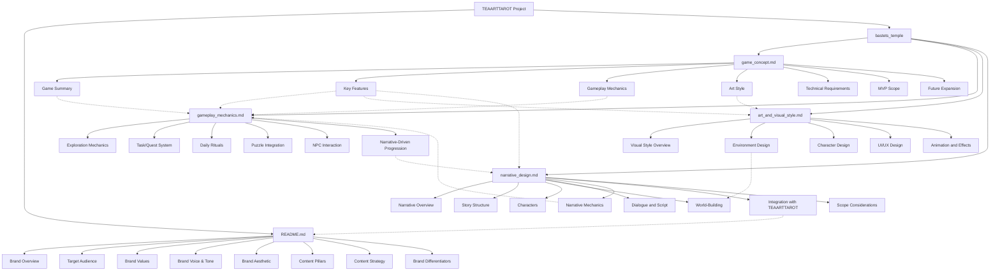

# Project Structure: Temple of Bastet: Guardian's Path

This Mermaid diagram represents the structure of the "Temple of Bastet: Guardian's Path" project, showing the relationships between different documents and their contents. The dotted lines indicate conceptual connections between different aspects of the game design.

- The root node represents the entire TEAARTTAROT project.
- README.md contains the brand identity information.
- The "bastets_temple" folder contains four main documents detailing different aspects of the game.
- Each document is broken down into its key sections.
- Connections between documents show how different aspects of the game design relate to each other.

This visual representation helps to understand the overall structure of the project and how different elements of the game design are interconnected.